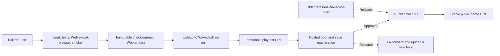

# Wavedash Implementation

- **Status:** Implementation-ready handoff
- **Repository:** RoboRush
- **Prepared:** 2026-08-15
- **Target:** Wavedash browser playtest, followed by controlled public publishing

## Objective

Publish RoboRush as a browser game on Wavedash with:

- a reproducible Godot 4.7.1 Web build;
- immutable, testable Wavedash builds;
- a friends-and-family playtest link;
- per-player cloud-backed saves that survive game deployments;
- CI that uploads only a tested artifact;
- manual approval before a build becomes public;
- rollback by selecting an already-uploaded build rather than rebuilding old source.

The implementation is complete only when a checkpoint created in hosted **Build A** is restored in hosted **Build B** before the main menu becomes interactive.

## Confirmed Baseline

- No unrelated worktree changes were present on `main` before this handoff file was added on 2026-08-15.
- Godot and export templates are pinned to 4.7.1 in `tools/engine.lock`.
- The existing `Web` preset is single-threaded, uses the Compatibility renderer, and disables extensions and PWA behavior.
- A fresh Web export contains nine root files and is approximately:
  - 41,437,537 bytes extracted;
  - 11,234,687 bytes zipped;
  - 39,513,091 bytes for `index.wasm`.
- Wavedash accepts a folder or ZIP up to 1 GB, so size is not a blocking constraint.
- RoboRush stores schema-v2 progress in `user://save.json`.
- `SaveManager` currently loads synchronously during `_ready()`.
- The main menu immediately reads tutorial, records, unlock, and checkpoint state.
- Therefore, cloud downloading after the main menu loads is unsafe: the game needs an explicit bootstrap phase.
- Wavedash cloud storage is per signed-in player. No anonymous cloud-save contract is documented.

## Non-Negotiable Release Gates

1. The uploaded Wavedash build boots, dismisses the Wavedash loader, reaches the main menu, and starts a run.
2. Local persistence continues working outside Wavedash.
3. Cloud failure never destroys or invalidates a valid local save.
4. A hosted Build A checkpoint survives browser close/reopen.
5. The same checkpoint survives Build A to Build B for the same Wavedash account.
6. A different Wavedash account receives separate progress.
7. The tested immutable build is the build that gets published; publishing must not rebuild it.
8. An older immutable build can be restored without source checkout or rebuilding.

## Target Delivery Flow



## Phase 0: Human Account Setup

### 0.1 Create the account and project

1. Create a Wavedash account at <https://wavedash.com/auth/sign-up>.
2. Open the Developer Portal at <https://wavedash.com/dev-portal>.
3. Create or select a team.
4. Create one project named `RoboRush`.
5. Leave the project unpublished.
6. Keep shareable build links restricted to team members until the first hosted build passes qualification.

Record these non-secret values:

- Wavedash game ID;
- team slug;
- game slug.

Do **not** put an API key in a document, issue, commit, chat, terminal transcript, or workflow variable that is not secret-protected.

### 0.2 Install and authenticate the CLI

Use Wavedash's documented installer:

```bash
curl -fsSL https://wavedash.com/cli/install.sh | sh
wavedash --version
wavedash auth login
wavedash auth status
```

Record the approved CLI version. CI must print and verify that version before an upload. If Wavedash does not provide an immutable versioned download, fail CI when the installed version changes so the new binary is reviewed before deployment.

Official references:

- <https://docs.wavedash.com/cli/installation>
- <https://docs.wavedash.com/cli/authentication>
- <https://docs.wavedash.com/cli/commands>

## Phase 1: Repository Configuration

### 1.1 Create the integration branch

Create a normal feature branch from clean `main`, using the repository's `codex/` prefix convention. Keep Wavedash integration isolated from unrelated gameplay work.

### 1.2 Initialize Wavedash

From the repository root:

```bash
wavedash init
```

Select the existing team and RoboRush project. Do not create a duplicate project.

Verify the generated `wavedash.toml`:

```toml
game_id = "REPLACE_WITH_WAVEDASH_GAME_ID"
upload_dir = "./build/web"

[godot]
version = "4.7.1-stable"
```

Requirements:

- Commit `wavedash.toml`.
- Do not commit credentials; the game ID is non-secret.
- Keep `upload_dir` pointed at a generated, ignored export directory.
- Never deploy a pre-existing or stale `build/web` directory.
- Every build script must empty and recreate the export directory first.

Official configuration reference: <https://docs.wavedash.com/cli/configuration>

## Phase 2: Install and Pin the Godot SDK

1. In Godot's AssetStore, locate **Wavedash SDK**.
2. Install it into the project.
3. Enable **WavedashGodot** under **Project Settings -> Plugins**.
4. Confirm the plugin registers `WavedashSDK` as an autoload.
5. Place `WavedashSDK` above every autoload that calls it.
6. Commit the add-on source required to build a clean clone.
7. Record the exact add-on version and upstream commit in a lock file or a new Wavedash section in `tools/engine.lock`.
8. Review the vendored code and license before merging.

Do not depend on whatever version happens to be newest in the AssetStore during CI.

Official references:

- <https://docs.wavedash.com/engines/godot>
- <https://godotengine.org/asset-library/asset/5010>
- <https://github.com/wvdsh/sdk-godot>

## Phase 3: Add a Safe Startup Bootstrap

### 3.1 Required files

Create:

- `scenes/ui/bootstrap.tscn`
- `scenes/ui/bootstrap.gd`
- `autoload/cloud_save_coordinator.gd`

Modify:

- `project.godot`
- `autoload/save_manager.gd`
- the existing main-menu entry flow only as needed to respect persistence readiness.

### 3.2 Autoload order

Use this relevant order:

1. `WavedashSDK`
2. `CloudSaveCoordinator`
3. existing gameplay autoloads
4. `SaveManager`, or another documented order that guarantees no consumer reads save state before initialization

Autoload ordering alone does not make asynchronous startup safe. The bootstrap scene must explicitly gate the main menu.

### 3.3 Bootstrap behavior

Make `bootstrap.tscn` the project's `run/main_scene`.

On launch it must:

1. Display an in-game `Connecting...` or `Syncing save...` state.
2. Connect Wavedash backend events.
3. Call `WavedashSDK.init()` exactly once.
4. Use debug logging only in development builds.
5. Wait for Wavedash connection and identity with a bounded timeout.
6. Enter local-only mode if the SDK, identity, or network is unavailable.
7. Reconcile local and cloud data when an authenticated player is available.
8. Call `SaveManager.initialize()` exactly once.
9. Wait for `SaveManager.initialized`.
10. Transition to the existing main menu.

Wavedash `init()` is required and also dismisses the platform loading overlay. Because cloud reconciliation occurs after `init()`, keep the in-game syncing screen visible until persistence is ready.

Official SDK setup: <https://docs.wavedash.com/sdk/setup>

### 3.4 Refactor SaveManager initialization

Current behavior to replace:

- `SaveManager._ready()` calls `load_game()` immediately.

Required contract:

- `_ready()` configures process mode and connects gameplay signals, but does not load persistent state.
- Add idempotent `initialize()`.
- `initialize()` performs the existing load exactly once.
- Add `signal initialized`.
- Expose a read-only initialized state.
- Refuse or safely queue persistence-dependent operations before initialization.
- Preserve current native and non-Wavedash behavior through the bootstrap's local-only path.

The main menu must not construct Continue/tutorial/record state until `SaveManager.initialized` has fired.

## Phase 4: Cloud-Save Reconciliation

### 4.1 Paths

Keep the existing canonical path:

```text
user://save.json
```

Reserve staging and bookkeeping paths:

```text
user://cloud/save.json
user://cloud/sync_state.json
user://cloud/archive/<timestamp>-local.json
user://cloud/archive/<timestamp>-cloud.json
```

Never download Wavedash data directly over `user://save.json`. Download to the staging path, validate it, choose a winner, and then adopt it atomically.

### 4.2 Startup reconciliation rules

Use a local-only sidecar containing the raw SHA-256 of the last successfully synchronized bytes and the last observed cloud ETag.

Apply this decision table:

| Local | Cloud | Last-synced base | Action |
|---|---|---|---|
| Absent | Absent | Any | Initialize defaults; upload after first committed save |
| Present | Absent | Any | Keep local and upload it |
| Absent | Present | Any | Validate and atomically adopt cloud |
| Equal | Equal | Any | Mark synchronized |
| Changed | Base unchanged remotely | Known | Upload local |
| Base unchanged locally | Changed | Known | Adopt cloud |
| Changed | Changed | Known | Prompt `Use this device` or `Use cloud`; archive loser |
| Different | Different | Unknown/first sync | Prompt; never guess or merge |

Guardrails:

- Never field-merge settings, counters, unlocks, or checkpoints.
- Reject and quarantine malformed JSON.
- Reject unexpectedly large save files; start with a 256 KiB ceiling.
- Do not adopt a future save schema into an older build.
- Do not upload during an offline/unknown session until remote state has been established.
- If a rollback encounters a future save version, preserve the current SaveManager behavior that freezes writes.
- Wavedash exposes ETag metadata but does not document conditional compare-and-swap upload. Two-device simultaneous writes therefore cannot be made perfectly race-free; detect likely conflicts and document the limitation.

### 4.3 Upload after a committed local save

Add a signal such as:

```gdscript
signal local_save_committed(path: String, content_hash: String)
```

Emit it only after:

1. the temporary file is written;
2. the prior primary is backed up when appropriate;
3. the rename over `user://save.json` succeeds;
4. Web filesystem synchronization has been requested.

The cloud coordinator must:

- keep local saving authoritative;
- upload only committed bytes;
- allow one upload at a time;
- coalesce rapid commits and eventually upload the newest generation;
- retry cloud failures with separate bounded backoff;
- never re-dirty or fail a successful local save because the network failed;
- expose `Saving...`, `Cloud synced`, and `Saved locally - cloud pending` states;
- trigger high-priority upload for existing immediate boundary checkpoint commits;
- avoid claiming `Cloud synced` until the SDK confirms success.

Do not rely on an asynchronous upload completing during tab close. A pending upload must retry on the next launch.

Official cloud-save reference: <https://docs.wavedash.com/sdk/cloud-saves>

### 4.4 Identity behavior

- Treat signed-in Wavedash identity as the cloud-save namespace.
- Missing identity means local-only persistence.
- State clearly in the beta instructions that testers need a Wavedash account for cross-build and cross-device saves.
- Prove user A and user B receive isolated storage.
- Prove sandbox and published storage behavior before assuming they share a namespace.

Official player reference: <https://docs.wavedash.com/sdk/players>

## Phase 5: Automated Tests

Keep platform calls behind a fakeable adapter. Native tests must not require live Wavedash access.

Add:

- `tests/test_cloud_save.gd`
- any supporting fake Wavedash port/adapter;
- registration in `tests/test_runner.tscn`.

Extend existing SaveManager, checkpoint, and menu tests.

Required cases:

1. SDK initialization is invoked once.
2. Cloud methods are never called before SDK initialization.
3. Menu/run navigation remains gated until persistence initializes or times out to local-only.
4. Native and direct non-Wavedash startup remains functional.
5. Local-only, remote-only, equal, one-side-changed, both-changed, and first-sync-different reconciliation.
6. Invalid, oversized, corrupt, and future-version cloud candidates cannot overwrite a good local save.
7. Download failure falls back without uploading unknown state.
8. Failed local writes never trigger cloud upload.
9. A successful retry uploads exactly one committed latest version.
10. Multiple commits are single-flight and the latest eventually reaches cloud.
11. Boundary checkpoints trigger an immediate upload request.
12. Divergence prompts rather than overwriting and archives the losing candidate.
13. Applying an adopted save refreshes settings and main-menu state once.
14. Initialization does not duplicate checkpoint, completion, unlock, or run-credit events.

All existing suites must still pass. Preserve downloadable logs because the current suite contains expected diagnostic output that cannot be judged solely by counting `ERROR:` lines.

## Phase 6: Reproducible Web Build

Create or extract reusable Web-only tooling:

- `tools/ci/build_web.sh`
- `tools/ci/verify_web.sh`

Do not invoke the current tag-only, four-platform release wrapper unchanged for every Web build.

The build must:

1. verify the exact Godot 4.7.1 editor and Web template;
2. use isolated writable user-data and template directories;
3. import cleanly;
4. run the full suite with an outer timeout;
5. recreate `build/web` from empty;
6. export the checked-in `Web` preset;
7. retain single-threaded Compatibility settings unless deliberately requalified;
8. validate root `index.html`, JavaScript, WASM, and PCK;
9. reject source/test/tool leakage;
10. record per-file size and SHA-256;
11. create a root-correct ZIP;
12. generate `build-info.json` with commit, Godot/template version, save schema, and content version;
13. visibly expose a short build ID in the game or shell.

Initial artifact budgets:

- hard Wavedash gate: total upload below 1 GB;
- project warning: unexpected growth from the current 41.4 MB extracted baseline;
- project warning: unexpected growth from the current 39.5 MB WASM baseline.

Do not fail merely because the raw WASM exceeds Cloudflare's unrelated limit.

## Phase 7: Local and Hosted Qualification

### 7.1 Local Wavedash sandbox

After a fresh export:

```bash
wavedash dev
```

Verify:

- Wavedash overlay completes and disappears;
- syncing state appears and completes or safely falls back;
- main menu initializes once;
- keyboard, mouse, controller, audio, fullscreen, resizing, pause, and focus work;
- save, reload, and Continue work;
- desktop/native launch remains unaffected.

`wavedash dev` proves SDK wiring only. It does not replace hosted qualification.

### 7.2 Push immutable Build A

```bash
wavedash build push -m "RoboRush browser beta Build A"
```

Record:

- commit SHA;
- artifact SHA-256;
- Wavedash CLI version;
- Wavedash build ID;
- immutable playtest URL.

Uploading must not publish automatically.

In the Developer Portal, enable **Shareable Build Links -> Anyone with link** only after the build is ready. This is an unlisted bearer-style URL, not password protection or a named allowlist. Anyone receiving the URL can forward it.

Build A test for a signed-in tester:

1. Open in a normal browser window.
2. Complete the tutorial.
3. Change settings.
4. Start a run and reach a floor-boundary checkpoint.
5. Wait for `Cloud synced`.
6. Close the tab.
7. Reopen the same playtest URL.
8. Confirm settings, tutorial, records, unlocks, and Continue state.
9. Complete at least one full run.

### 7.3 Push immutable Build B

Make a harmless visible build-ID change, build from a new commit, and push:

```bash
wavedash build push -m "RoboRush browser beta Build B"
```

Using the same signed-in tester:

1. Open Build B.
2. Verify the cloud candidate is resolved before the main menu.
3. Confirm Build A settings and progress.
4. Continue the Build A checkpoint.
5. Save again and wait for `Cloud synced`.
6. Reopen Build B and reconfirm state.

This Build A to Build B result is the primary go/no-go gate.

### 7.4 Manual browser matrix

Before family invitations, test the hosted URL in:

- current Chrome or Edge;
- current Firefox;
- Safari separately;
- keyboard and mouse;
- a physical controller;
- signed-in normal mode;
- signed-out/local-only behavior;
- temporary offline/reconnect behavior;
- user A versus user B isolation;
- two tabs and, if claimed, two devices;
- audio after player interaction;
- fullscreen and focus recovery;
- one complete run.

Do not advertise mobile/touch support without separate qualification.

## Phase 8: GitHub Actions CI/CD

Create:

- `.github/workflows/web-ci.yml`
- `.github/workflows/wavedash-upload.yml`
- optionally `.github/workflows/wavedash-publish.yml` after manual publication is proven.

### 8.1 Trigger matrix

| Trigger | Build/test | Wavedash upload | Publish |
|---|---:|---:|---:|
| Pull request | Yes | No | No |
| Manual verification | Yes | No | No |
| Push to protected `main` | Yes | Yes, immutable build | No |
| Manual approved build ID | No rebuild | No | Yes |
| Rollback to older build ID | No rebuild | No | Yes, older ID |

### 8.2 PR workflow

Run with minimum `contents: read` permission and no Wavedash credentials:

1. check out the commit;
2. verify/install pinned Godot and templates;
3. clean import;
4. run native suites with writable isolated `user://` and an outer timeout;
5. require nonzero failures to fail, exactly one terminal PASS, and no script/compile/crash/leak condition;
6. build Web into an empty directory;
7. validate and checksum files;
8. serve over HTTP with production-equivalent MIME handling;
9. run Chromium smoke against the exported game;
10. upload one immutable ZIP, checksums, metadata, and logs as the CI artifact.

### 8.3 Main upload workflow

Create a GitHub Environment named `wavedash-beta`.

Environment secret:

- `WAVEDASH_TOKEN`

Non-secret variables may include:

- expected Wavedash CLI version;
- game ID;
- team slug;
- game slug.

The upload job must:

1. run only after all build and smoke gates pass;
2. download the exact tested artifact rather than rebuild;
3. recalculate and verify its digest;
4. extract into an empty temporary directory matching `upload_dir`;
5. install the Wavedash CLI;
6. print and compare `wavedash --version` with the approved value;
7. run `wavedash build push -m "Build <full-commit-sha>"` with `WAVEDASH_TOKEN` available only to that step/job;
8. retain the CLI output, build ID, playtest URL, commit, and artifact digest;
9. serialize uploads so two `main` builds cannot race.

Do not use `pull_request_target`. Do not expose the token to PRs or browser-smoke jobs. Pin GitHub Actions by full commit SHA.

Official CI reference: <https://docs.wavedash.com/tutorials/ci-cd>

### 8.4 Publication

For the first several releases, publish manually from the Developer Portal after hosted qualification.

Later, a protected manual workflow may accept an existing Wavedash build ID and run:

```bash
wavedash publish BUILD_ID
```

Requirements:

- GitHub Environment approval before credentials are exposed;
- strict build-ID validation;
- no source checkout or build step;
- verify the ID belongs to RoboRush;
- record the prior and new published IDs;
- run a post-publish hosted smoke.

Publishing chooses an already-uploaded immutable build. It must never rebuild source.

## Phase 9: Sharing and Rollout

### Closed playtest

- Use the Build A/Build B playtest URLs.
- Set **Anyone with link** only for approved builds.
- Tell testers the URL is unlisted, not access-controlled.
- Testers who want cloud persistence must use a Wavedash account.
- Each immutable build has its own playtest URL, so send the new approved URL when the cohort moves builds.

### Public release

After qualification, publish the approved build. The stable public URL follows:

```text
https://wavedash.com/games/<game-slug>
```

Complete the Wavedash title, description, screenshots, tags, and player instructions before public publishing.

### Cohorts

1. **Internal:** owner account; Build A/Build B save qualification.
2. **Trusted:** 3-5 signed-in friends/family; launch, input, audio, save, checkpoint, full-run validation.
3. **Restricted by distribution:** 10-20 people with the unlisted link; structured feedback and browser matrix.
4. **Public:** publish only after the previous cohorts pass.

## Rollback Runbook

Wavedash retains immutable builds. Rollback means publishing an older build ID:

```bash
wavedash publish OLDER_BUILD_ID
```

Before rollback:

1. identify the currently published build ID;
2. identify the known-good older build ID;
3. compare their save schemas and content versions;
4. confirm the older build will not overwrite a newer save;
5. obtain approval;
6. publish the older ID without rebuilding;
7. run hosted boot and cloud-load smoke;
8. record the rollback event.

Prefer a forward hotfix after a save-schema increase. RoboRush's future-version protection prevents destructive writes, but an older build may leave players unable to accumulate new progress.

Official publishing and rollback reference: <https://docs.wavedash.com/publishing/publish>

## File Change Map

| File | Intended change |
|---|---|
| `wavedash.toml` | Non-secret Wavedash project/build configuration |
| `addons/wavedash/**` | Pinned Wavedash Godot SDK |
| `tools/engine.lock` or new lock file | SDK and CLI provenance/version expectations |
| `project.godot` | Plugin/autoload order and bootstrap main scene |
| `scenes/ui/bootstrap.tscn` | Startup sync/loading UI |
| `scenes/ui/bootstrap.gd` | SDK init, bounded fallback, menu transition |
| `autoload/cloud_save_coordinator.gd` | Staging, reconciliation, uploads, retries, status |
| `autoload/save_manager.gd` | Explicit initialization and committed-save signal |
| `tests/test_cloud_save.gd` | Fake-backed cloud behavior and conflict tests |
| `tests/test_save.gd` | Initialization and commit-signal coverage |
| `tests/test_checkpoint.gd` | Immediate checkpoint upload request |
| `tests/test_menus.gd` | Menu gated until persistence readiness |
| `tests/test_runner.tscn` | Register new suites |
| `tools/ci/build_web.sh` | Clean reproducible Web build |
| `tools/ci/verify_web.sh` | Artifact contract, size, references, checksums |
| `.github/workflows/web-ci.yml` | Secretless PR verification |
| `.github/workflows/wavedash-upload.yml` | Upload tested `main` artifact |
| `.github/workflows/wavedash-publish.yml` | Optional approved publish/rollback by build ID |

## Definition of Done

- [x] Wavedash account, team, and single RoboRush project exist.
- [x] `wavedash.toml` is committed without credentials.
- [x] Wavedash Godot SDK is vendored, reviewed, enabled, and pinned.
- [x] WavedashSDK initializes exactly once.
- [x] Bootstrap gates the main menu on persistence readiness or explicit local-only fallback.
- [x] Cloud downloads use staging and validation rather than overwriting canonical saves.
- [x] Successful local commits drive single-flight, coalesced cloud uploads.
- [x] Cloud errors cannot destroy or invalidate local progress.
- [x] Divergent saves prompt and archive rather than silently overwrite or merge.
- [x] Existing native tests and behavior remain green.
- [x] New cloud, menu-gating, and checkpoint tests pass.
- [ ] Clean Web export and browser smoke pass in CI.
- [ ] Build A boots and restores its own cloud-backed checkpoint.
- [ ] Build B restores Build A's checkpoint before the main menu.
- [ ] Different Wavedash accounts receive isolated saves.
- [ ] Chrome/Edge, Firefox, Safari, keyboard, and physical controller are qualified.
- [ ] `main` uploads only the exact tested artifact.
- [ ] Publication selects an existing build ID and never rebuilds.
- [ ] Rollback to an older immutable build has been rehearsed once.
- [ ] First 3-5 family testers receive the approved playtest URL and account/save instructions.

## Immediate Next Step

The repository implementation can begin after the account owner supplies these non-secret identifiers:

- Wavedash game ID;
- team slug;
- game slug.

Never supply the Wavedash API key to an implementation agent. Store it directly as the `WAVEDASH_TOKEN` secret in the protected GitHub Environment when Phase 8 begins.
